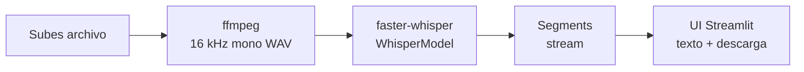

# 🎙️ Audicop

> Suelta cualquier audio o vídeo. Recibe el texto. Sin configurar nada.

[](https://www.python.org/downloads/)
[](LICENSE)
[](https://streamlit.io/)

Audicop es una app web local de transcripción que se ejecuta enteramente
en tu máquina. Detecta el hardware automáticamente y elige el mejor
modelo Whisper que tu equipo puede correr — sin que tengas que pensarlo.

---

## 🚀 Instalación

### Windows (la mayoría de usuarios)

1. **Descarga el proyecto.** En este repo, clic verde "Code" → "Download ZIP".
   Descomprime donde quieras.
2. **Doble clic en `scripts\run.bat`.** Se abre una ventana negra que va
   informando de cada paso.
3. **Espera 5–10 minutos** la primera vez (instala todo, descarga el modelo
   Whisper). Las siguientes veces arranca en segundos.
4. Tu navegador se abre solo en `http://localhost:8501`. **Listo.**

> 💡 La ventana negra se queda abierta. Para parar la app, ciérrala o pulsa
> `Ctrl+C`.

### macOS / Linux

```bash
git clone https://github.com/JoseAAA/audicop.git
cd audicop
./scripts/run.sh
```

### ¿Qué hace el script automáticamente?

1. Instala [`uv`](https://docs.astral.sh/uv/) (gestor de Python rápido) si no lo tienes.
2. Detecta tu hardware: si tienes GPU NVIDIA, instala las librerías CUDA
   automáticamente.
3. Crea un entorno virtual aislado con todas las dependencias (versiones
   pinchadas vía `uv.lock` — sin sorpresas entre máquinas).
4. Lanza la app en `http://localhost:8501`.

**No necesitas Python instalado** — `uv` lo descarga si hace falta. **No necesitas
ffmpeg** — viene empaquetado. **No necesitas CUDA toolkit** — sólo el driver NVIDIA.

---

## ✨ Features

- 🤖 **Autodetección de hardware** — elige modelo y `compute_type` por ti.
- 🎬 **Multi-formato** — audio (mp3, wav, m4a, ogg, flac, aac) y vídeo (mp4, mkv, mov, avi, webm).
- 📦 **Sin ffmpeg de sistema** — el binario viene incluido vía `imageio-ffmpeg`.
- 🔒 **100% local** — nada sale de tu equipo.
- ⚡ **Streaming** — el texto aparece a medida que se transcribe, con barra de progreso.
- 🌍 **Multi-idioma** — autodetección o forzado (es, en, pt, fr, it, de).
- 🛠️ **Modo avanzado** — sobrescribe la recomendación si quieres.

---

## 🧠 Cómo funciona



1. Subes un archivo (≤ 1 GB).
2. ffmpeg empaquetado lo convierte a 16 kHz mono.
3. faster-whisper decodifica y emite segmentos a medida que avanza.
4. Streamlit los muestra y, al terminar, ofrece descarga `.txt` y copia.
5. Los temporales se borran al final.

---

## 🖥️ Hardware soportado

Audicop elige el modelo según la memoria **libre** (no la total) en el
momento de detección. Si tienes 16 GB de RAM pero el navegador y el
sistema operativo usan 10, sólo quedan 6 GB realmente disponibles —
respetar eso evita que el equipo se ahogue.

| Recurso libre                     | model_size  | compute_type   |
|-----------------------------------|-------------|----------------|
| GPU CUDA, VRAM libre ≥ 8 GB       | large-v3    | float16        |
| GPU CUDA, VRAM libre 4–8 GB       | large-v3    | int8_float16   |
| GPU CUDA, VRAM libre 2.5–4 GB     | medium      | int8_float16   |
| GPU CUDA, VRAM libre < 2.5 GB     | small       | int8_float16   |
| Solo CPU, RAM libre ≥ 6 GB        | small       | int8           |
| Solo CPU, RAM libre 3–6 GB        | base        | int8           |
| Solo CPU, RAM libre < 3 GB        | tiny        | int8           |

> Si no estás de acuerdo con la elección, abre **Modo avanzado** en la
> barra lateral y fuerza el modelo y `compute_type` que prefieras. O
> cierra apps que consuman memoria y recarga la página para que recalcule.

---

## 🎞️ Formatos y límites

- **Audio:** mp3, wav, m4a, ogg, flac, aac
- **Vídeo:** mp4, mkv, mov, avi, webm — *se extrae sólo la pista de audio* via
  `ffmpeg -vn`, así que un vídeo de 5 GB y su versión "audio extraído" pesan
  lo mismo a la hora de transcribir.
- **Duración soportada:** hasta **3 horas** probadas. Whisper procesa con una
  ventana deslizante de 30 s, así que la VRAM se mantiene constante sin
  importar la duración total — puedes forzar más, pero ahí ya estamos fuera
  de la envolvente probada.
- **Tamaño máximo de subida:** **2 GB** por la pestaña "Subir archivo".

### Vídeos grandes (> 2 GB) → pestaña "Archivo local"

Si tu vídeo supera los 2 GB (típico de HD/4K de varias horas), usa la
pestaña **"Archivo local"** y pega la ruta absoluta. Audicop lee el archivo
**directamente del disco**, sin subida — más rápido y sin límite de tamaño.
Sólo funciona porque la app corre en tu máquina; no expone tu disco a
ningún proceso externo.

### ¿Cuánto tarda?

Depende de tu hardware. Audicop te lo muestra en pantalla, pero como
referencia rápida (1 hora de audio):

| Hardware                 | Modelo elegido      | Tiempo estimado |
|--------------------------|---------------------|-----------------|
| GPU NVIDIA (≥ 4 GB libre)| `large-v3` int8_fp16| ~10 min         |
| GPU NVIDIA gama media    | `medium`            | ~6 min          |
| Solo CPU, 16 GB RAM      | `small` int8        | ~60 min         |
| Solo CPU, 8 GB RAM       | `base` int8         | ~25 min         |
| Solo CPU, < 8 GB RAM     | `tiny` int8         | ~12 min         |

---

## 🔒 Privacidad y red

Audicop es **local por diseño**. Tu audio nunca sale de tu equipo.

**Lo único que toca la red, y sólo una vez por modelo:**

- Descarga del modelo Whisper desde
  [huggingface.co/Systran](https://huggingface.co/Systran) en la primera
  ejecución. La app te avisa antes de descargar.

**Lo que NUNCA hace Audicop:**

- ❌ Subir tus archivos a ninguna nube.
- ❌ Enviar telemetría, analytics ni "phone home".
- ❌ Acceder a webcam, micrófono o portapapeles.
- ❌ Leer archivos fuera de los que tú subes manualmente.

**Paquetes usados para detectar tu hardware** (todos open source y
verificables):

| Paquete       | Para qué                                  | Permisos       |
|---------------|-------------------------------------------|----------------|
| `psutil`      | Cuenta de cores y memoria total / libre   | Sólo lectura   |
| `nvidia-smi`  | Nombre + memoria de GPU NVIDIA            | Sólo lectura   |
| `platform`    | Nombre del sistema operativo (stdlib)     | Sólo lectura   |

Si quieres aislar completamente el equipo: descarga el modelo en otra
máquina con `huggingface-cli download Systran/faster-whisper-<size>` y
copia `~/.cache/huggingface/hub/` antes de ejecutar Audicop.

---

## ⚙️ Configuración avanzada

Para forzar un modelo concreto, usa el panel **Modo avanzado** en la
barra lateral. La idea es que toda la configuración viva en la UI; no
hay flags ni variables de entorno que aprender.

### Comandos útiles con uv

```bash
uv sync                                # instalar / actualizar deps
uv sync --extra dev                    # incluye ruff, mypy, pytest
uv run streamlit run audicop/app.py    # arranca la app sin activar el venv
uv run pytest                          # corre los tests
uv run ruff check .                    # lint
uv lock --upgrade                      # actualiza el lock a las últimas versiones
```

---

## 🆘 Troubleshooting

**El modelo tarda mucho en descargarse la primera vez.**
Es normal: `large-v3` ocupa ~3 GB. Las siguientes ejecuciones leen el
modelo desde la caché de HuggingFace en tu disco.

**Sale `WinError 1314` o "el cliente no dispone de un privilegio requerido" en Windows.**
Audicop ya detecta este caso automáticamente: si tu cuenta de Windows no
tiene permiso para crear enlaces simbólicos (lo típico en laptops
corporativas con cuenta estándar), descargamos el modelo como archivos
copiados en `~/.cache/audicop/models/`. Si aun así falla, prueba a
borrar `~/.cache/huggingface` (puede tener una descarga parcial corrupta
de antes) y vuelve a abrir la app.

**No detecta mi GPU NVIDIA.**
Audicop usa `nvidia-smi` para detectar la GPU. Abre una terminal y
verifica que el comando funciona:

```bash
nvidia-smi
```

Si no funciona, faltan o están corruptos los drivers de NVIDIA;
descárgalos desde https://www.nvidia.com/Download/index.aspx. Si
`nvidia-smi` funciona pero la app aún muestra "Sin CUDA", relanza
`scripts/run.sh` (o `scripts\run.bat`) — el script reinstalará las libs
CUDA en el venv automáticamente al detectar la GPU.

**`ffmpeg failed to convert`.**
El archivo de origen probablemente está corrupto o usa un códec exótico.
Prueba a reconvertirlo o a abrirlo en VLC para verificar que se reproduce.

**Mi archivo pesa más de 1 GB.**
Sube el límite editando `.streamlit/config.toml` (`maxUploadSize`).
Para audios muy largos, considera dividirlos antes de transcribir.

**`CUDA out of memory`.**
Tu GPU se quedó sin VRAM con el modelo recomendado. Abre **Modo avanzado**
y baja a un tamaño más pequeño (p. ej. `medium` o `small`) o cambia
`compute_type` a `int8_float16`.

---

## 🧱 Stack y créditos

- [faster-whisper](https://github.com/SYSTRAN/faster-whisper) — motor de
  transcripción basado en CTranslate2.
- [Whisper](https://github.com/openai/whisper) de OpenAI — el modelo
  subyacente. Audicop sólo provee la envoltura local.
- [Streamlit](https://streamlit.io/) — UI.
- [imageio-ffmpeg](https://github.com/imageio/imageio-ffmpeg) — binario
  ffmpeg empaquetado vía pip.
- [psutil](https://github.com/giampaolo/psutil) — detección de CPU/RAM.
- [`nvidia-smi`](https://developer.nvidia.com/nvidia-system-management-interface) —
  detección de GPU (instalado con cualquier driver NVIDIA).
- [`nvidia-cublas-cu12`](https://pypi.org/project/nvidia-cublas-cu12/) y
  [`nvidia-cudnn-cu12`](https://pypi.org/project/nvidia-cudnn-cu12/) —
  runtime CUDA empaquetado en wheels (sólo si tienes GPU). No necesitas
  instalar el toolkit CUDA del sistema.
- [uv](https://docs.astral.sh/uv/) — gestor de Python y dependencias.

---

## 🗺️ Roadmap

- [ ] Diarización (separar hablantes).
- [ ] Exportar a **SRT** y **VTT** con timestamps.
- [ ] Modo batch para procesar varias carpetas a la vez.
- [ ] Resaltado en el reproductor sincronizado con el texto.

---

## 🤝 Contributing

Issues y PRs bienvenidos. Lee [CONTRIBUTING.md](CONTRIBUTING.md) para los
detalles de tests y estilo.

---

## 📜 License

MIT — ver [LICENSE](LICENSE).

---

## English

> Drop any audio or video, get text. Zero config.

Audicop is a local web app that transcribes audio and video files using
[faster-whisper](https://github.com/SYSTRAN/faster-whisper). It detects
your hardware (CPU, RAM, NVIDIA GPU + VRAM) and picks the best Whisper
model your machine can run. Everything stays on your computer.

### Quick start

```bash
git clone https://github.com/JoseAAA/audicop.git
cd audicop
./scripts/run.sh        # or scripts\run.bat on Windows
```

Open http://localhost:8501.

### Highlights

- Auto-selects the right Whisper model for your hardware.
- Supports common audio (mp3, wav, m4a, ogg, flac, aac) and video (mp4,
  mkv, mov, avi, webm) formats.
- ffmpeg is bundled — no system install required.
- 100% local; the only network call is the initial model download.
- Streams partial transcripts with a progress bar.

See the Spanish sections above for the full documentation.
